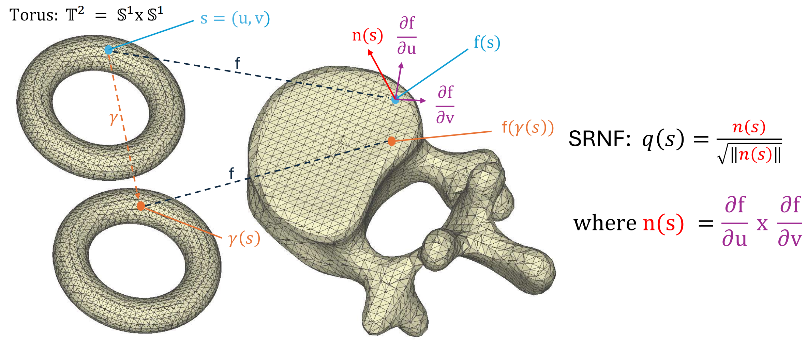

# THIS REPOSITORY IS STILL IN DEVELOPMENT

# SALSA
Shape Analysis for Lumbar Spine Assessments

This repository contains the code and displays some results of the SALSA pipeline. We apply this pipeline to two publicly available datasets: 1.) RSNA-LumbarDisc dataset 2.) SPIDER dataset.

# Results:

To see the full results with explanation, we invite you to read our paper. We include more visuals on our [website](https://nsivakanthan.github.io/SALSA/).

# Pipeline

  

The main code file is main.py which runs the following files (order matters):

  - mesh.py - Extracts shapes (triangluar meshes; .ply files) from MRIs (.nii.gz files) using totalspineseg from the spinal cord toolbox (SCT) (must download and use specific version of totalspineseg).
  
  - reg.py - Cleans and initial alignment of shapes of the lumbar spine. Can also be used to perform Hungarian/Jonker-Volgenant registration of shapes.
  
  - (SRNF registration) After cleaning and initial alignment, perform SRNF registration. More requirements and code described later. 
  
  - pca.py - Obtain prinicpal modes of variation, visualize these modes, prepare csv files for regression on both SPIDER and RSNA datasets.
  
  - regression_rsna.R and/or regression_spider.R - Obtain binary and multi-label classification results for various spinal conditions.
  
  - vis_reg.py, vis_reg_rsna.py - Visualize regression directions to interpret regression results.

# Elastic Registration w/ SRNF:

  

The main theoretical contribution of this work comes from improvement of results using Elastic registration with square root normal fields (SRNF), a registration framework deloped by Jermyn et al.. We employ code developed by Bauer et al. and Hartman et al. to register vertebra and discs using the SRNF. This requires downloading code from their github repository and making minimal adjustments to change which functions were being used. An environment must be managed to run their code revolved around the PyKeops package. Their code also requires a linux system to run (can also use WSL). 

The following code files are used for Elastic Registration:
  
  - srnf_reg.py - Register shapes and obtain means on a per shape level.
  
  - srnf_reg_all.py - Register shapes and obtain means pooled between vertebrae and discs, respectively.

# Key References:
## Elastic Registration-
Ian Jermyn, Sebatian Kurtek, Hamid Laga, Anuj Srivastava: Elastic Shape Analysis of Three-dimensional Objects

## SRNF Matching-
Martin Bauer, Nicolas Charon, Philipp Harms, Hsi-Wei Hsieh: A numerical framework for elastic surface matching, comparison, and interpolation.

Emmanuel Hartman, Yashil Sukurdeep, Eric Klassen, Nicolas Charon, Martin Bauer: Elastic Shape Analysis of Surfaces with Second-Order Sobolev Metrics: A Comprehensive Numerical Framework.

## TotalSpineSeg-
Warszawer et al.: TotalSpineSeg: Robust Spine Segmentation with Landmark-Based Labeling in MRI.
