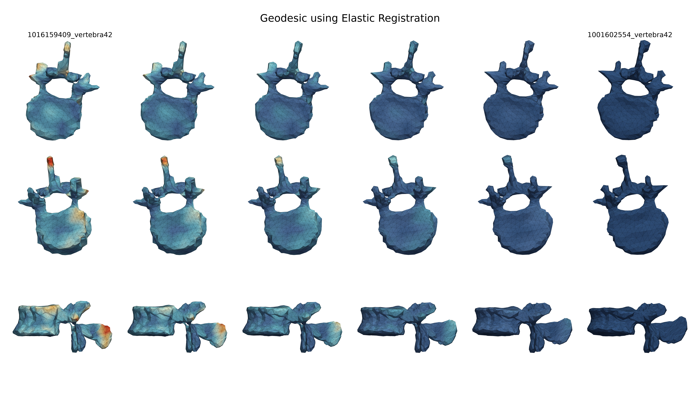
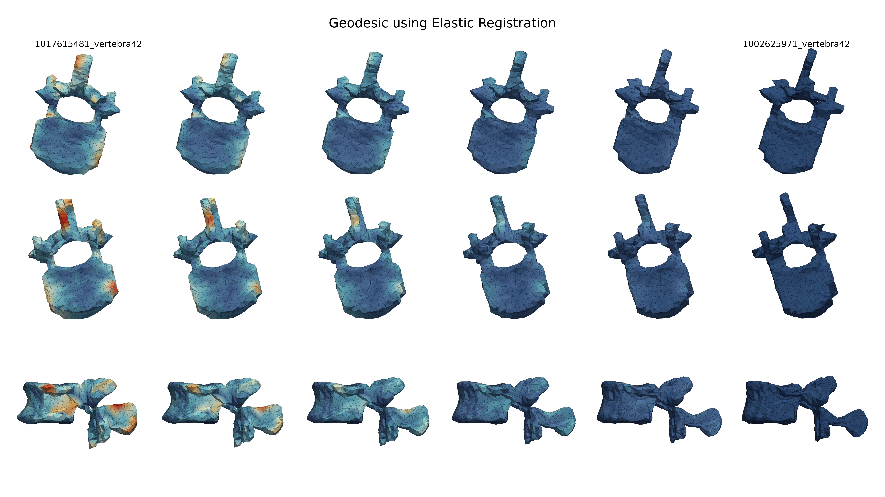
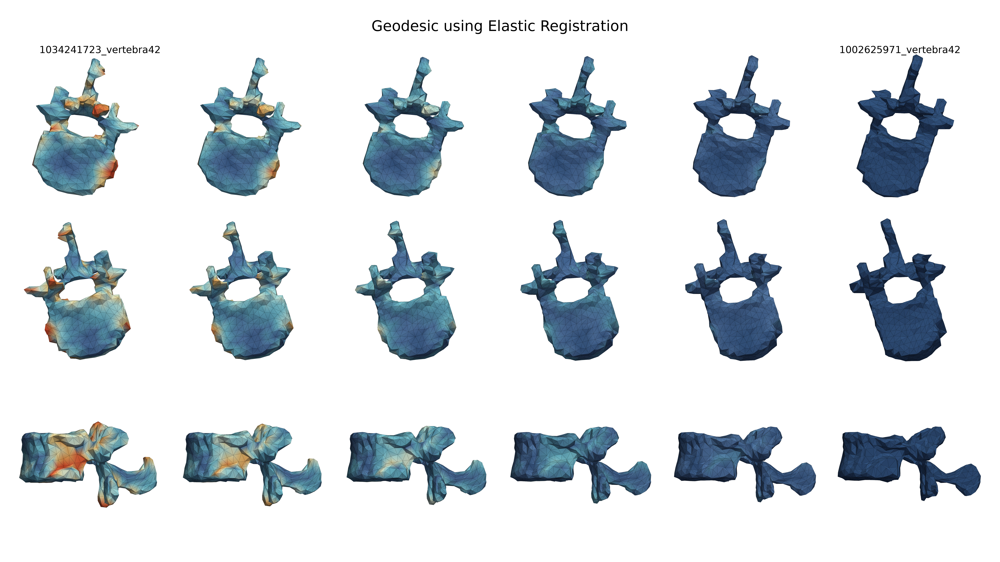

# Shape Analysis for Lumbar Spine Assessments

## The SALSA Pipeline

The SALSA pipeline starts with extracting shapes of the spine from medical images (MRI or CT scans). We use the Spinal Cord Toolbox (SCT) & Totalspineseg to segment the spine into its components, and then use the Marching Cubes algorithm to obtain the surface of shapes from segmented labels. Once we have these shapes across our entire dataset, we can apply a series of shape analysis tools. With the end goal of creating statistical shape models of the lumbar spine, registration of shapes across our sample is key. We use Elastic registration which we show, in our paper, outperforms a baseline method. With shapes registered, we can perform statistical analysis: obtaining means, conducting PCA to analyze principal modes of deformations, and finally use this information to classify degenerative spinal conditions. In our paper, we compare our results to recent works which primarily use deep neural networks. Despite using a less complex model for classification, we achieve comparable results with the advantage of our interpretability and visualizations. The following visuals emphasis the advantages that come from using a statistical shape model to understand the morphology of the lumbar spine.

## Elastic Registration of Shapes

With the Elastic registration framework using square root normal fields (SRNF), we register the shapes of lumbar vertebrae and discs across our sample data. The novelty of this work comes from applying Elastic registration with SRNF to toroidal objects (the vertebrae). 

Here are a few examples of geodesics, the shortest path between two shapes in terms of SRNF distance. For more details, please see the paper.

## Statistical Shape Analysis of the Lumbar Spine

Once we have obtained registered shapes across our sample, we can perform statistical shape analysis. Our goal is to develop a model for an average shape, quantify variation in terms of deformation fields, and use this information to perform classification of degenerative conditions such as spinal stenosis and pfirrmann grading. 

### Mean Shapes of Spinal Components

Here is a display of the mean of the L1 vertebra across our entire sample (right) along with a sample of 6 of the shapes used to generate this mean (left).

<video controls width="800">
  <source src="videos/vertebra41_mean.mp4" type="video/mp4">
</video>

### Shape PCA and Principal Deformations

Once we have generated means for each of our shapes (all vertebra and disc levels), we can perform SVD on the registered shapes to obtain the principal modes of deformations for each shape (or pooled shapes with a pooled mean). The top three modes of variation are displayed below as deformation fields starting at the mean.

<video controls width="400">
  <source src="videos/vertebra41_direction1_scale.mp4" type="video/mp4">
</video>

<video controls width="400">
  <source src="videos/vertebra41_direction2_scale.mp4" type="video/mp4">
</video>

<video controls width="400">
  <source src="videos/vertebra41_direction3_scale.mp4" type="video/mp4">
</video>

### Generating Shapes from Principal Deformations

We evaluate the quality of the PCA-based shape representations by generating synthetic spinal structures. Specifically, we impose a probabilistic model on the leading PCA coefficients, assuming independent zero-mean Gaussian distributions. Model parameters are estimated from the training data. New shapes are then generated by sampling coefficients from this distribution and mapping them back to the object space via the PCA basis.

We visualize these shapes, $\mu_{j} + Z_{j} V_{j}$ where $Z_{j}\in\mathbb{R}^{d}$ are the random normal coefficients and $V_{j}$ is a matrix of the top singular vectors of the $j^{th}$ object.

Here is an example of shapes of L1 Vertebra generated from our shape model.
<video controls width="800">
  <source src="videos/vertebra41_samples.mp4" type="video/mp4">
</video>

### Principal Component Shape Regression

We perform classification of several degenerative spinal conditions using weighted Elastic-Net logistic regression achieving results comparable to black-box methods. We visualize deformations from mean shapes along coefficient directions, $\mu_{j} + \hat\beta_{j} V_{j}$ where $\hat\beta_{j}\in\mathbb{R}^{d}$ are the estimated regression coefficients and $V_{j}$ is a matrix of the top singular vectors of the $j^{th}$ object. These deformations highlight structural variations associated with a condition. 

First, we have the deformations in the L1 Vertebra associated with Disc Narrowing in the T12-L1 Disc.
<video controls width="400">
  <source src="videos/Disc_Narrowing_41_91_t2.mp4" type="video/mp4">
</video>

Here, we have the deformations in the T12-L1 Disc associated with Disc Narrowing of itself.
<video controls width="400">
  <source src="videos/Disc_Narrowing_91_91_t2.mp4" type="video/mp4">
</video>

Here, we have the deformations in the L1 Vertebra associated with Pfirrmann Grade of the L1-L2 Disc.
<video controls width="800">
  <source src="videos/Pfirrmann_41_1_t2.mp4" type="video/mp4">
</video>

Here, we have the deformations in the L1-L2 Disc associated with Pfirrmann Grade of itself.
<video controls width="800">
  <source src="videos/Pfirrmann_92_1_t2.mp4" type="video/mp4">
</video>

## Reproducibility

The source code for this work is available in the
[GitHub repository](https://github.com/nsivakanthan/SALSA).

